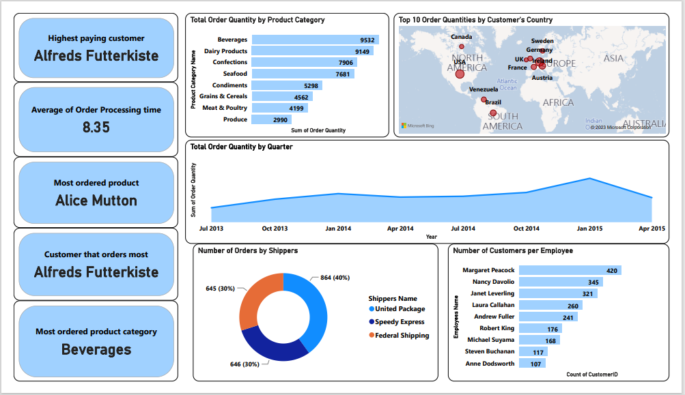

 # Analysis of Northwind Traders Datasets Using Power BI

---

## Introduction

Use of various types of data visuals in creating interactive dashboards as well as displaying of inter relationships among different datasets are important aspects of data analysis that depict datasets in an easily understandable manner and hereby help in decision making based on generated insights.

In this analysis, an interactive dashboard was created by combining multiple visualizations with each telling its own story. Seven different datasets were used for this analysis. They are:

1.) Employee data (https://github.com/SeunA88/Analysis-of-Northwind-Traders-Datasets-Using-Power-BI/blob/main/employees.csv).

2.) Customers data (https://github.com/SeunA88/Analysis-of-Northwind-Traders-Datasets-Using-Power-BI/blob/main/customers.csv).

3.) Categories data (https://github.com/SeunA88/Analysis-of-Northwind-Traders-Datasets-Using-Power-BI/blob/main/categories.csv).

4.) Order_details data (https://github.com/SeunA88/Analysis-of-Northwind-Traders-Datasets-Using-Power-BI/blob/main/order_details.csv).

5.) Orders data (https://github.com/SeunA88/Analysis-of-Northwind-Traders-Datasets-Using-Power-BI/blob/main/orders.csv).

6.) Products data (https://github.com/SeunA88/Analysis-of-Northwind-Traders-Datasets-Using-Power-BI/blob/main/products.csv).

7.) Shippers data (https://github.com/SeunA88/Analysis-of-Northwind-Traders-Datasets-Using-Power-BI/blob/main/shippers.csv).

The datasets were joined together using their common columns and Complete dataset containing all necessary columns and information was generarted. The Complete dataset/table can be seen here (https://github.com/SeunA88/Analysis-of-Northwind-Traders-Datasets-Using-Power-BI/blob/main/Complete_dataset.xlsx).  This Complete dataset was then used for the analysis. Data Analysis Expression DAX was used to generate some insights and graphcal visuals were designed from the complete datasets as well.

## Creating the Dashboard

In creating the dashboard, some data were selected to aid understandng and to bring out some insights from the data. The following data were focussed on and visualised in the dashboard. 

- **Most ordered product category**: This gives an insight into the most selling product category, by knowing this, the business can focus more on this product category, study why its being ordered the most and see how they can optimize the sales of products in this product category. The following DAX was used to generate this insight:

   **Most ordered product category = FIRSTNONBLANK(TOPN(1, VALUES('Full table'[Product Category Name]), SUM('order + order_details'[quantity])),1)**
  
   From this analysis, the most ordered product category is **Beverages**. 
  
- **Highest paying customer**: This can also be termed the Most Valuable Customer, knowing this can help the business take note of the buying trend of this customer, find means of retaining this customer including giving of discounts, and also focusing on satisfactory services especially prompt delivery to this customer. The following DAX was used to generate this insight:

   **Highest paying customer = FIRSTNONBLANK(TOPN(1, VALUES('Full table'[Customer Company Name]), SUM('order + order_details'[unitPrice])),1)**

  From this analysis, the Highest paying customer is **Alfred Futterkiste**. 
  
- **Order Processing time**: Using DAX, a new column was created to show the order processing time, an average of this was then calculated and displayed on the dashboard. This insight can help in optimizing the order fulfilment rte and reduce/eliminate delayed orders as well as avoid cancelled orderd due to delayed processing/delivery. The following DAX was used to generate this insight:

  **Order Processing time = DATEDIFF('Full table'[Order Date].[Date],'Full table'[Order Shipped Date].[Date],DAY)**

  From this analysis, the Average Order Processing time is **8.35 days**. 

- **Most ordered product**: This gives an insight into the most selling product, by knowing this, the business can focus more on this product, study why its being ordered the most and see how they can optimize the sales of this product. The following DAX was used to generate this insight:

   **Most ordered product = FIRSTNONBLANK(TOPN(1, VALUES('Full table'[Product Name]), SUM('order + order_details'[quantity])),1)**

   From this analysis, the most ordered product is **Alice Mutton**.
  
- **Customer that orders most**: This insight is as valuable as the highest paying customer, With this insight just like that of the highest paying customer, the business can take note of the buying trend of this customer, find means of retaining this customer including giving of discounts, and also focusing on satisfactory services especially prompt delivery to this customer. The following DAX was used to generate this insight:
  
    **Customer that orders most = FIRSTNONBLANK(TOPN(1, VALUES('Full table'[Customer Company Name]), SUM('order + order_details'[quantity])),1)**

     From this analysis, the customer that orders the most is **Alfred Futterkiste**.
  
- **Total Order Quantity by Product Category**: From this analysis, insight on the frequently ordered product categories can be derived. This can help monitor and drive sales towards these product categories and hence maximize sales and profit. **Beverages product category** tops the chart, followed by other product categories like Dairy Products, Confections and Seafood.
  
- **Order Quantities by Customer's Country**: With this analysis, we can observe the countries where most orders are from. This can help with adequate planning of logistics and order delivery. Also, possibility of warehouses in the top ordering countries may not be a bad idea in the near future. **USA, Germany, followed by Austria** are the top three countries where most orders come from.
  
- **Total Order Quantity by Quarter**: This analysis shows the trend of total order quantities by quarter starting from **July 2013 to April 2015**. From the trend grapgh, it can be observed that the highest order quantity was in **Jan 2015**.

- **Number of Orders by Shippers**: This insight is targeted towards optimization of logistics and order delivery, most importantly order fulfilment. From this analysis it can be seen that most orders are shipped by **United Package**. With more analysis, insights on order fulfilment by each Shipping agency reveals **United Package** also fulfilled the most orders.
  
- **Number of Customers per Employee**: Recognition of the Employee that handles the most customers and orders successfully can help optimize the performance of the employee as well as the colleagues, all towards creating an encouraging and enabling environment for profit maximization and business success. **Margaret Peacock** had the most customers and also handled the most orders.

#### Please find below the dashboard created. Feel free to interact with dashboard here (https://github.com/SeunA88/Early-steps-with-Power-BI-Dashboard-and-DAX/blob/main/Task%203.pbix)

----

- Data Modelling: This gives an insight into the relationship among the 7 datasets used for this analysis. Find below the data model for the datasets.
  

---

## Conclusion
By interacting with the dashboard above, more insights can be generated from the Northwind traders datasets and by studying the inter relatonship among the datasets as shown in the data model, diverse analytical understanding and judgements can be made. All these insights will help in maximizing the profitability and overall success of Northwind Traders business.
