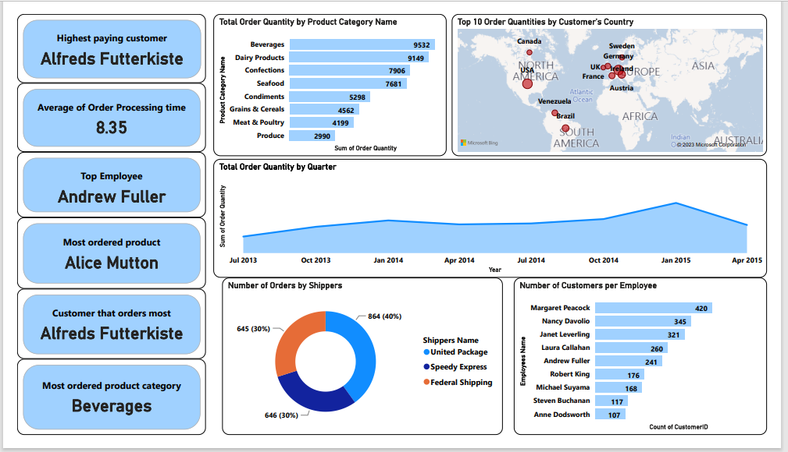
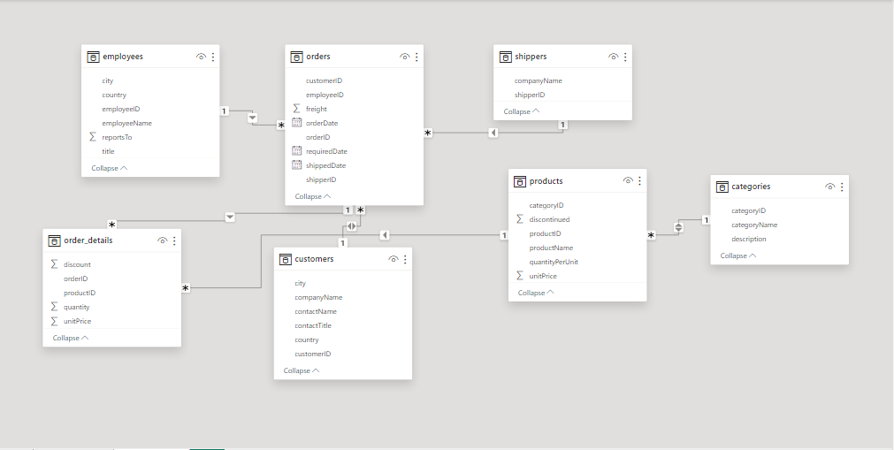

 # Analysis of Northwind Traders Datasets Using Power BI

---

## Introduction

Use of various types of data visuals in creating interactive dashboards as well as displaying of inter relationships among different datasets are important aspects of data analysis that depict datasets in an easily understandable manner and hereby help in decision making based on generated insights.

In this analysis, an interactive dashboard was created by combining multiple visualizations with each telling its own story. Seven different datasets were used for this analysis. They are:

1.) Employee data (https://github.com/SeunA88/Analysis-of-Northwind-Traders-Datasets-Using-Power-BI/blob/main/employees.csv).

2.) Customers data (https://github.com/SeunA88/Analysis-of-Northwind-Traders-Datasets-Using-Power-BI/blob/main/customers.csv).

3.) Categories data (https://github.com/SeunA88/Analysis-of-Northwind-Traders-Datasets-Using-Power-BI/blob/main/categories.csv).

4.) Order_details data (https://github.com/SeunA88/Analysis-of-Northwind-Traders-Datasets-Using-Power-BI/blob/main/order_details.csv).

5.) Orders data (https://github.com/SeunA88/Analysis-of-Northwind-Traders-Datasets-Using-Power-BI/blob/main/orders.csv).

6.) Products data (https://github.com/SeunA88/Analysis-of-Northwind-Traders-Datasets-Using-Power-BI/blob/main/products.csv).

7.) Shippers data (https://github.com/SeunA88/Analysis-of-Northwind-Traders-Datasets-Using-Power-BI/blob/main/shippers.csv).

The datasets were joined together using their common columns and Complete dataset containing all necessary columns and information was generarted. The Complete dataset/table can be seen here (https://github.com/SeunA88/Analysis-of-Northwind-Traders-Datasets-Using-Power-BI/blob/main/Complete_dataset.xlsx).  This Complete dataset was then used for the analysis. Data Analysis Expression DAX was used to generate some insights and graphcal visuals were designed from the complete datasets as well.

## Creating the Dashboard

In creating the dashboard, some data were selected to aid understandng and to bring out some insights from the data. The following data were focussed on and visualised in the dashboard. 

- **Most ordered product category**: This gives an insight into the most selling product category, by knowing this, the business can focus more on this product category, study why its being ordered the most and see how they can optimize the sales of products in this product category. The following DAX was used to generate this insight:

   **Most ordered product category = FIRSTNONBLANK(TOPN(1, VALUES('Full table'[Product Category Name]), SUM('order + order_details'[quantity])),1)**
  
   From this analysis, the most ordered product category is **Beverages**. 
  
- **Highest paying customer**: This can also be termed the Most Valuable Customer, knowing this can help the business take note of the buying trend of this customer, find means of retaining this customer including giving of discounts, and also focusing on satisfactory services especially prompt delivery to this customer. The following DAX was used to generate this insight:

   **Highest paying customer = FIRSTNONBLANK(TOPN(1, VALUES('Full table'[Customer Company Name]), SUM('order + order_details'[unitPrice])),1)**

  From this analysis, the Highest paying customer is **Alfred Futterkiste**. 
  
  
- **Order Processing time**: Using DAX, a new column was created to show the order processing time, an average of this was then calculated and displayed on the dashboard. This insight can help in optimizing the order fulfilment rte and reduce/eliminate delayed orders as well as avoid cancelled orderd due to delayed processing/delivery. The following DAX was used to generate this insight:

  **Order Processing time = DATEDIFF('Full table'[Order Date].[Date],'Full table'[Order Shipped Date].[Date],DAY)**

  From this analysis, the Average Order Processing time is **8.35 days**. 

  
- Most ordered product = FIRSTNONBLANK(TOPN(1, VALUES('Full table'[Product Name]), SUM('order + order_details'[quantity])),1)
- Customer that orders most = FIRSTNONBLANK(TOPN(1, VALUES('Full table'[Customer Company Name]), SUM('order + order_details'[quantity])),1)
-
-
-
- Total Order Quantity by Product Category
- Order Quantities by Customer's Country
- Total Order Quantity by Quarter
- Number of Orders by Shippers
- Number of Customers per Employee: Recognition of the Employee that handles the most customers and orders successfully can help optimize the performance of the employee as well as the colleagues, all towards creating an encouraging and enabling environment for profit maximization and business success.
  
- 

Average age of the bank clients/depositors: This gives an insight into the average age of depositors at the bank and informed decisions can be made as to what age range can be focussed on when campaigning to clients about new bank term deposits. From the data, it can be seen that 41 years is the average age of the bank depositors.
  
- Average yearly balance of the bank clients/depositors: This gives an insight into the average yearly balance of the bank depositors and can also be used to narrow down campaign focus to prospective clients. From the data, it can be seen that $1,362 is the average yearly balance of the bank depositors.
  
- Total number of subscribed/target clients : An insight into how many of the clients/ depositors subscribed to the term deposits after campaigns is seen here, and also which clients haven't subscribed but are still targets/potential subscribers. A total 45,211 clients were found.
    
- Total campaign by job type: This gives an insight into the job type that had the highest total number of campaigns. It can be seen that blue-collar, management and technician jobs topped the chart in the campaigns.
  
- Total number of poutcome by education: This gives an insight into the Education level of depositors based on previous campaign outcomes. It shows the focus of the previous campaign was majorly on secondary school level, followed by Tertiary level.  Depending on these outcomes and targets, campaigns can be tailored towards whatever level of education can give the desired outcome.
  
- Total number of subscribed/target clients by credit in default: This gives an insight into the percentage of depositors with credit in default. Over 95% of depositors do not have a credit in default.
  
- Total number of subscribed/target clients by marital status: This gives an insight into the marital status of the depositors. About 60% of the depositors are married, about 27% are single while about 12 % are divorced.
- 
- Total number of subscribed/target clients by campaign: What are the outcomes of the campaign based on client subscription? How many campaigns were carried out before the client subscribed for term deposit? These insights can be drawn from this visual.
  
- Average balance by subscribed/target clients: From this visual, it can be seen that about 72% of clients haven't subscribed to the term deposit yet, also depositors that have subscribed to the term deposit have an average yearly balance of about $1,804.
  
- A slicer was added to the dashboard to help in filtering the subscribed/target clients. When filter is selected as 'yes" or "no", data can be compared across the dashboard and an insight into a summary/update of the success of the campaign projects can be visualised.

#### Please find below the dashboard created. Feel free to interact with dashboard here (https://github.com/SeunA88/Early-steps-with-Power-BI-Dashboard-and-DAX/blob/main/Task%203.pbix)

#### Representing all data.

----

- Data Modelling: This gives an insight into the relationship among the 7 datasets used for this analysis. Find below the data model for the datasets.
  

---

## Conclusion
By interacting with the dashboard above, more insights can be generated from the Northwind traders datasets and by studying the inter relatonship among the datasets as shown in the data model, diverse analytical understanding and judgements can be made. All these insights will help in maximizing the profitability and overall success of Northwind Traders business.
